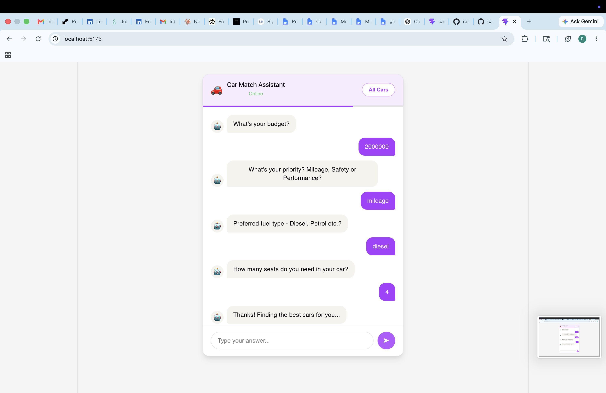
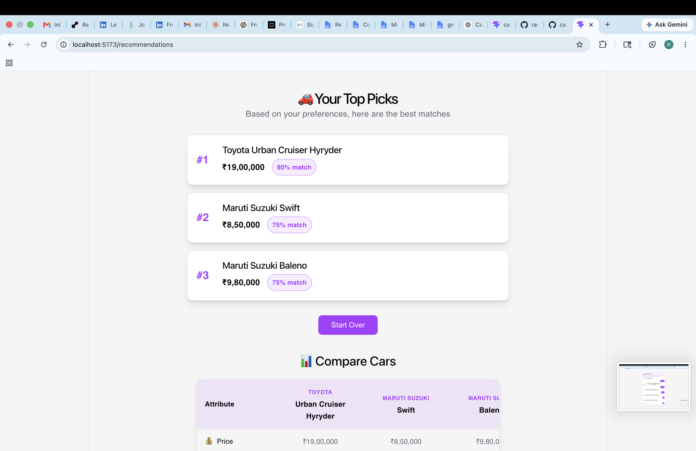
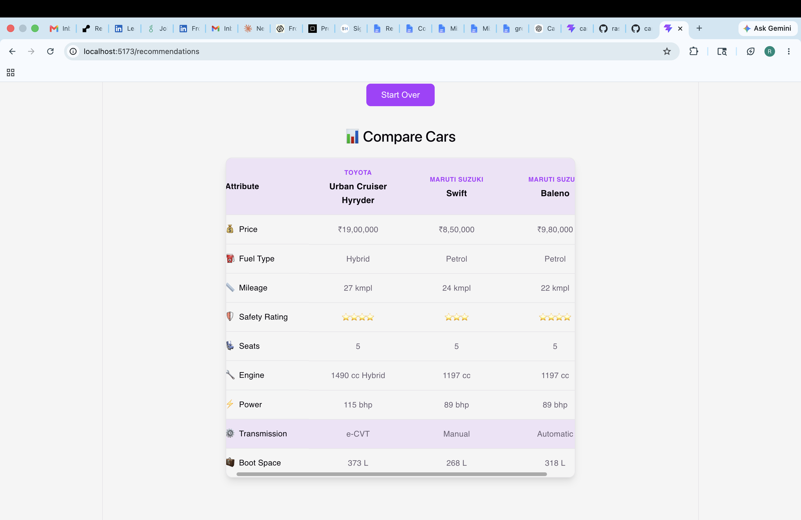
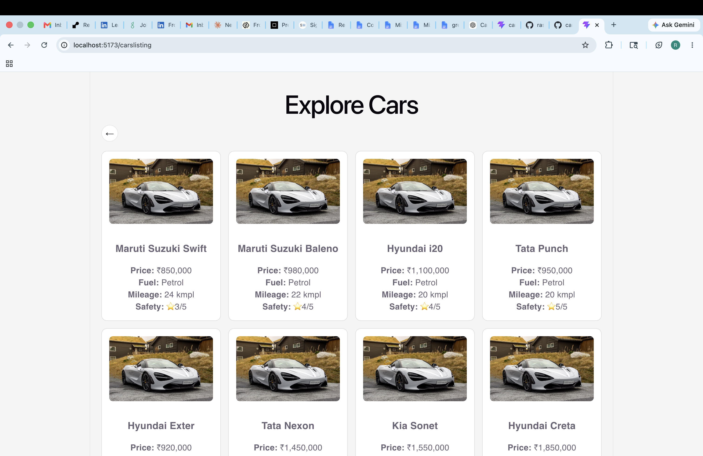

# carRecommenationEngine

# Car Match Assistant Frontend

## Overview

Car Match Assistant is a lightweight car recommendation platform that helps users discover vehicles based on their preferences. Rather than browsing hundreds of listings, users answer a short series of questions through a chatbot-style interface and receive personalized recommendations, so that when it comes on the cardekho platform, he can go from “I don’t know what to buy” to “I’m confident about my shortlist.”.

The goal of this project was to build a functional MVP that demonstrates recommendation logic, user interaction, and comparison workflows without relying on external paid AI services.

---

## What I Built

The frontend provides:

* Chatbot-style onboarding flow
* Multi-step preference collection
* Recommendation results screen
* Car comparison table
* Browse-all-cars catalog view
* Responsive React-based user interface to integrate scalably to Nodejs backend

Users answer questions about:

* Budget - (Input Values like 1500000, 87000 etc.)
* Fuel type - (Input Values like Diesel and Petrol)
* Seating requirements - (Input values like 5)
* Purchase priority (Input values - Safety, Mileage, Performance)

Based on these preferences, the frontend requests recommendations from the backend and displays the top matching vehicles.

---
## Screenshots

### Chatbot Experience



### Recommendations



### Car Comparison



### Car Catalog



## What I Deliberately Cut

To keep the project focused and deliverable within the available time, I intentionally excluded:

* User authentication
* Persistent user profiles
* Real AI/LLM integration
* Advanced filtering and search
* Saved favorites
* Car detail pages
* Production-grade UI design
* Database integration

The focus was on recommendation logic and end-to-end functionality rather than feature completeness.

---

## Tech Stack

### React + Vite

Chosen because:

* Fast development experience
* Minimal configuration
* Excellent developer tooling
* Lightweight setup for MVPs

### React Router

Used for:

* Navigation between chatbot, recommendations, and listings pages
* Passing recommendation results between screens

### Fetch API

Used for communication with the backend recommendation service.

---

## AI Tool Usage

AI tools (ChatGPT, Amazon Q) were used as development assistants.

### Delegated to AI

* Setting up React and Node boilerplates from scratch
* Reviewing architecture decisions
* Debugging API integration issues
* Generating starter UI structures
* Brainstorming recommendation approaches

### Implemented Manually

* Application architecture
* Component structure
* State management
* Recommendation flow
* API integration
* Navigation and routing
* Debugging and testing
* Scoring logic from scratch at the backend

### Where AI Helped Most

* Accelerating boilerplate creation
* Reviewing implementation approaches
* Identifying bugs quickly
* Suggesting MVP scope reductions

### Where AI Got In The Way

* Generated code occasionally required adjustment to fit the project's data structures
* Some recommendations were overly complex for an MVP
* Suggested implementations still required manual verification and debugging
* Missed edge cases and conditional rendering like map((car) => car.item and not car?.item

---

## Future Improvements (Additional 4 Hours)

If given another 4 hours, I would add:

1. Recommendation explanation engine ("Why this car was recommended")
2. Car detail pages
3. Advanced filtering and sorting
4. Saved favorites using local storage
5. Improved UI and responsive design
6. Loading states and error handling
7. Charts for comparing recommendations
8. Search functionality across all vehicles
9. Allowed any form of input from the user to make it more lively, for the MVP, I used specic formats like 1200000 and Diesel etc.

---
The project is deployed to be run easily on Vercel - 
## Test Live - https://car-recommenation-engine.vercel.app/

## Running Locally

```bash
npm install
npm run dev
```
Localhost port - 5173
